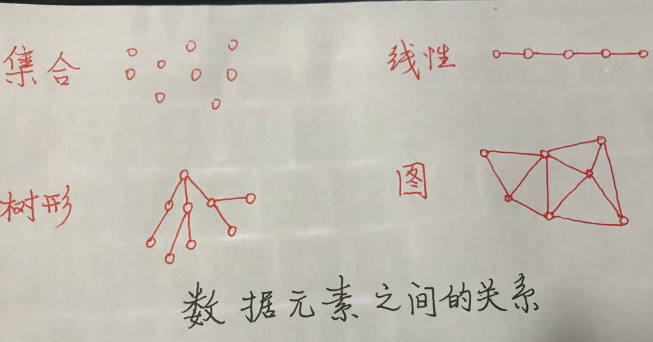

## 数据结构概述
　　“数据结构”是计算机专业的一门重要的基础课程。计算机科学领域中，尤其是系统软件和应用软件的设计和实现中都用到各种数据结构。学习“数据结构”既为进一步学习其他软件技术提供必要的准备知识，更有助于提高`软件设计`和`程序编制`水平。本章将介绍数据结构的基本概念，阐明数据结构内的逻辑关系，讨论它们在计算机中的存储表示。
#### 数据
　　数据就是对现实世界的事物，采取用计算机能够识别、存储和处理的方式（比如数字、字符等）进行的描述。**简言之，数据就是计算机化的信息。**
　　`数据元素`是数据的基本单位，即数据集合中的个体。有些情况下也把数据元素称为`结点、记录、表目`等。一个数据元素可由一个或多个`数据项目`组成，数据项目是有独立含义的数据最小单位。有是也把数据项称作`域、字段`等。例如，可以将一个学生的有关信息作为一个数据元素，它由姓名、专业、学号等数据项组成。
#### 数据结构
　　**数据结构**（data structure)是相互之间存在一种或多种特定关系的数据元素的集合。
　　被计算机加工的数据元素不是孤立的，它们彼此间，一般存在着某些逻辑上的联系，这些联系需要在对数据进行存储和加工时反映出来。因此，数据结构概念一般包括三个方面的内容：`数据之间的逻辑关系`、`数据在计算机中的存储方式`、`以及在这些数据上定义的运算`。
　　一、数据的逻辑结构    
　　数据的逻辑结构只抽象地反映数据元素间逻辑关系，而不管其在计算机中的存储表示方式。
　　数据的逻辑结构分为线性结构和非线性结构。若种数据元素之间的逻辑关系可以用一个线性序列简单地表示出来，则称之为线性结构，否则称为非线性结构。线性表是典型的线性结构，而树、图等都是非线性结构。
　　二、数据的存储结构
　　数据的存储结构是逻辑结构在计算机存储器里的实现。
　　为全面地表示一个逻辑结构，它在存储器中的映象应包括数据元素自身值的表示和数据元素之间的关系的表示两个方面。因此，存储在计算机中的数据，其结点的各域按性质可分为两大类，一类是存放自身值的域，例如姓名、专业、学号等，通常称之为自身信息域，可用标识符`info`表示这些域的全体；另一类是存放该结点与其他结点的关系的域名，例如一个或多个指针，或者其他形式的连接信息，通常称之为连接信息域，可用标识符`link`表示这些域的全体。一般情况下，存储结构中结点的形式为：

