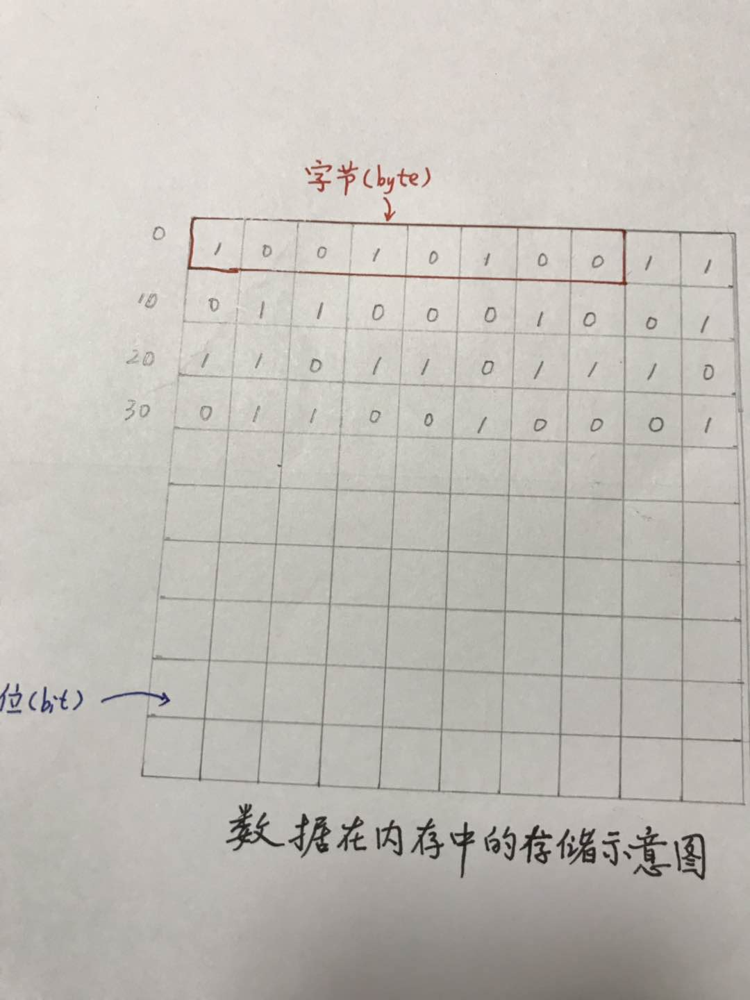
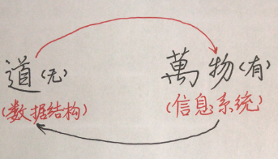
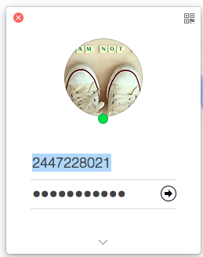

## 数据结构概述
　　“数据结构”是计算机专业的一门重要的基础课程。计算机科学领域中，尤其是系统软件和应用软件的设计和实现中都用到各种数据结构。学习“数据结构”既为进一步学习其他软件技术提供必要的准备知识，更有助于提高`软件设计`和`程序编制`水平。本章将介绍数据结构的基本概念，阐明数据结构内的逻辑关系，讨论它们在计算机中的存储表示。
#### 数据
　　数据就是对现实世界的事物，采取用计算机能够识别、存储和处理的方式（比如数字、字符等）进行的描述。**简言之，数据就是计算机化的信息。**    
　　`数据元素`是数据的基本单位，即数据集合中的个体。有些情况下也把数据元素称为`结点、记录、表目`等。一个数据元素可由一个或多个`数据项目`组成，数据项目是有独立含义的数据最小单位。有是也把数据项称作`域、字段`等。例如，可以将一个学生的有关信息作为一个数据元素，它由姓名、专业、学号等数据项组成。    
　　  
#### 数据在计算机中的表现
  

* 数据在计算机中最小单位是二进制的`0` 或`1`
* 计算机中存储的是`0`或`1`的序列
* 没有明确的意义
* 具体的意义需要另外解释  

#### 数据类型   
数据类型是一个值或者表达式所有可能取值的范围，以及在这些值上允许进行的操作。因此数据类型是一个`值的集合`和定义在这个值集上的`一组操作`的总称。    
引入`数据类型`的目的，从硬件角度看，是作为解释计算机内存中信息含义的一种手段，而对使用数据类型的用户来说，实现了信息的隐蔽，即将一切用户不必了解的细节都封装在类型中。  
　　
#### 数据结构
　　**数据结构**（data structure)是相互之间存在一种或多种特定关系的数据元素的集合。    
　　被计算机加工的数据元素不是孤立的，它们彼此间，一般存在着某些逻辑上的联系，这些联系需要在对数据进行存储和加工时反映出来。因此，数据结构概念一般包括三个方面的内容：`数据之间的逻辑关系`、`数据在计算机中的存储方式`、`以及在这些数据上定义的运算`。    
　　**一、数据的逻辑结构**   
　　数据的逻辑结构只抽象地反映数据元素间逻辑关系，而不管其在计算机中的存储表示方式。    
　　数据的逻辑结构分为线性结构和非线性结构。若种数据元素之间的逻辑关系可以用一个线性序列简单地表示出来，则称之为线性结构，否则称为非线性结构。线性表是典型的线性结构，而树、图等都是非线性结构。    
　　    
　　
　　**二、数据的存储结构**    
　　数据的存储结构是逻辑结构在计算机存储器里的实现。    
　　为全面地表示一个逻辑结构，它在存储器中的映象应包括数据元素自身值的表示和数据元素之间的关系的表示两个方面。因此，存储在计算机中的数据，其结点的各域按性质可分为两大类，一类是存放自身值的域，例如姓名、专业、学号等，通常称之为自身信息域，可用标识符`info`表示这些域的全体；另一类是存放该结点与其他结点的关系的域名，例如一个或多个指针，或者其他形式的连接信息，通常称之为连接信息域，可用标识符`link`表示这些域的全体。一般情况下，存储结构中结点的形式为：    
　　        
　　    
　　这里说的是一般情况，而在某些存储结构中，结点可以不包括连接信息域，这时结点的形式为：    
　　   
　　    
　　  
　　**三、数据的运算**    
　　数据的运算是定义在数据的逻辑结构上的，但运算的具体实现要在存储结构上进行。数据的各种逻辑结构有相应的各种运算，每种逻辑结构都有一个运算的集合。常用的运算有`检索、插入、删除、更新、排序`等。    
　　数据的运算是数据结构的一个重要方面，讨论任何一种数据结构时，都离不开对该结构上的数据运算及实现算法的讨论。

#### 主要的数据存储方式    
有多种不同的方式来实现数据的逻辑结构到计算机存储器的映象。下面介绍两类最主要的存储方式，大多数数据结构的存储表示都采用其中一类方式，或两类方式的结合。    

　　**一、顺序存储结构**        
　　这种存储方式主要用于线性的数据结构，它把逻辑上相邻的数据结构存储在物理上相邻的存储单元里，结点之间的关系由存储单元的邻接关系来实现。    
　　主要特点是：    
　　1、结点中只有自身信息域，没有连接信息域，因此存储密度大，存储空间利用率高；    
　　2、可以通过计算直接确定数据结构中第i个结点的存储地址Li=L0+(i-1)\*m，其中L0为第一个结点的存储地址，m为每一个结点所占用的存储单元个数；    
　　3、插入、删除运算不便，会引起大量结点的移动。    
　　
　　**二、链式存储结构**    
　　链式存储结构就是在每一个结点中至少包括一个指针域，用指针来体现数据元素之间逻辑上的联系。这种存储结构可把人们从计算机存储单元的`相继性限制`中解放出来，可以把逻辑上相邻的两个元素存放在不相邻的存储单元中；还可以在线性编址的计算机存储器中表示结点之间的非线性联系。
　　主要特点是：    
　　1、结点中除自身信息域外，还有连接信息，因此比顺序存储结构的存储密度小，存储空间利用率低；    
　　2、逻辑上相邻的结点物理上不必邻接，可用于表、树、图等逻辑结构的存储表示；    
　　3、插入、删除操作灵活方便，不必移动结点，只要改变结点中的指针值即可。  

#### 数据结构与“道”

> 一阴一阳之谓道。    
    
> 有物混成，先天地生，寂兮寥兮，独立而不改，周行而不殆，可以为天地母。 
吾不知其名，字之曰道，强为之名曰大。 ————《道德经》第二十五章  

如果把计算机信息世界比拟与一个宇宙，那么二进制中的`0`和`1`分别代表着阴和阳，那么基于这种阴阳学说语义框架上的抽象的**数据结构就是信息领域中的道。**    
> 视之不见名曰夷，听之不闻名曰希，搏之不得名曰微。 
此三者不可致诘，故混而为一。 
一者，其上不皦，其下不昧。 
绳绳不可名，复归于无物，是谓无状之状、无物之象，是谓惚恍。 ————《道德经》第十四章    

`其上不皦`：道的本体
`其下不昧`：道的化身（万事万物）
道（数据结构） = 一切的概念（一切信息系统）

 

这是一个相对的概念！所谓一物一太极，正如庄子所说的“一尺之捶,日取其半,万世不竭。”，每一个局部，同是也是一个的整体。

数据结构就像“道”一样，是一个极其抽象的概念，它无色、无声、无形，但在信息世界里，无处、无时不在，可以生发出信息世界中的万事万物（一切的信息系统），万事万物又复归于它。“形而上者，谓之道。形而下者谓之器。”道是体，器是形。道是抽象，器是形象。正如我们用器去感应道的存在一样，我们总是通过学习某种具体的数据结构，比如树，去感悟数据结构的内涵。    

现随便举一个例子，来说明数据结构在信息世界中无处不在，比如：    
用户登录QQ，用户输入正确的QQ号和密码后，点击登录按钮进入到QQ程序。在这个登录过程中，用户感觉不到数据结构的存在。但在背后其实是有数据结构支持的，所有的QQ信息可能以记录的方式存储在某种数据库中，所有的用户信息同属于一个集合。然后根据某一QQ号作为查询条件，在数据库中进行检索，为了提高检索效率，应该以QQ号字段建立了索引，索引技术就用到了B树这种数据结构。    
        
   
即便是登录界面本身的呈现，也会运用到各种数据结构。嗯，数据结构，就是信息世界中的道，或者说，可以用道的法则来解释信息世界中的数据结构。

